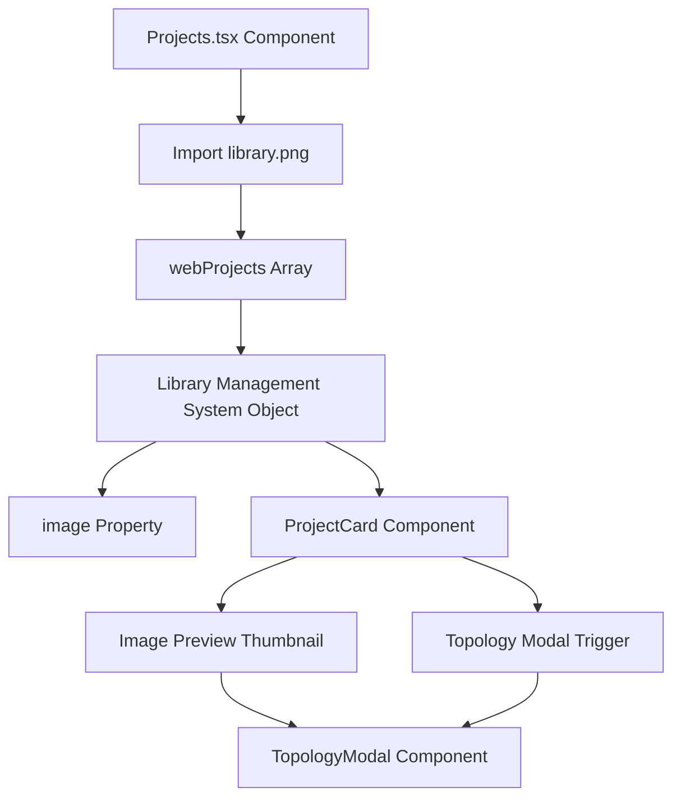
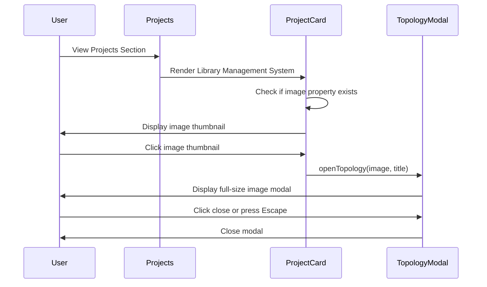
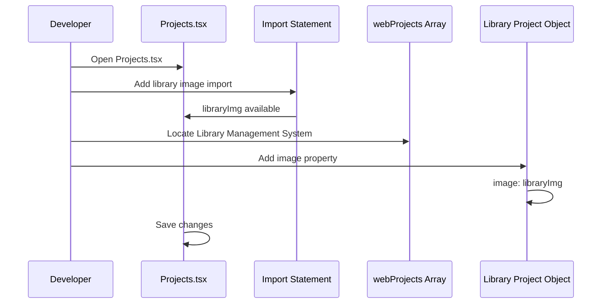

# Design Document: Add Library Project Image

## Overview

This feature adds the library.png image to the Library Management System project card in the Projects component. The image will be displayed as a preview thumbnail (similar to the EduPlatform project) and will be clickable to open a full-size topology modal view. This enhancement improves visual consistency across web-based projects and provides users with a visual preview of the Library Management System interface.

The implementation involves importing the library.png image file and adding it to the Library Management System project object in the webProjects array, following the exact pattern established by the EduPlatform project.

## Architecture



## Sequence Diagrams

### Image Display Flow



## Components and Interfaces

### Project Interface

**Purpose**: Defines the structure of a project object in the Projects component

**Interface**:
```typescript
interface Project {
  title: string;
  description: string;
  tags: string[];
  status?: "live" | "upcoming";
  links?: ProjectLink[];
  image?: string;           // Preview image for the project card
  topologyImage?: string;   // Full-size image for topology modal
}
```

**Responsibilities**:
- Define the shape of project data
- Ensure type safety for project properties
- Support optional image properties for visual previews

### Modified Component: Projects.tsx

**Purpose**: Main component that displays all projects with their images

**Key Changes**:
1. Add import statement for library.png
2. Add `image` property to Library Management System project object

**Responsibilities**:
- Import and manage project images
- Render project cards with image previews
- Handle topology modal interactions

## Data Models

### Library Management System Project Object

```typescript
{
  title: "Library Management System",
  description: "Web-based library system with role-based access for students, teachers, and admins. Supports book cataloguing, borrowing, returns, and overdue tracking.",
  tags: ["React", "Node.js", "PostgreSQL", "RBAC"],
  image: libraryImg,  // NEW: Add this property
  links: [
    { label: "GitHub", href: "https://github.com/feynet1/Library-management-system", icon: "github" },
    { label: "Live Demo", href: "https://library-management-system-nu-five.vercel.app/", icon: "live" },
  ],
}
```

**Validation Rules**:
- `image` must be a valid imported image module
- `image` path must resolve to an existing file
- Image file must be in a supported format (png, jpg, jpeg, webp)

## Main Algorithm/Workflow



## Key Functions with Formal Specifications

### Function 1: Image Import

```typescript
import libraryImg from "./web-project-image/library.png";
```

**Preconditions:**
- File `./web-project-image/library.png` exists
- File path is relative to Projects.tsx location
- Image file is readable and valid

**Postconditions:**
- `libraryImg` variable contains valid image module reference
- Image can be used in JSX img src attribute
- Vite/bundler can resolve and bundle the image

**Loop Invariants:** N/A (no loops)

### Function 2: Project Object Modification

```typescript
const webProjects: Project[] = [
  // ... other projects
  {
    title: "Library Management System",
    description: "Web-based library system with role-based access for students, teachers, and admins. Supports book cataloguing, borrowing, returns, and overdue tracking.",
    tags: ["React", "Node.js", "PostgreSQL", "RBAC"],
    image: libraryImg,  // Add this line
    links: [
      { label: "GitHub", href: "https://github.com/feynet1/Library-management-system", icon: "github" },
      { label: "Live Demo", href: "https://library-management-system-nu-five.vercel.app/", icon: "live" },
    ],
  },
  // ... other projects
];
```

**Preconditions:**
- `libraryImg` is imported and available in scope
- Library Management System object exists in webProjects array
- Project interface allows optional `image` property

**Postconditions:**
- Library Management System object has `image` property set to `libraryImg`
- ProjectCard component will render image thumbnail
- Image is clickable to open topology modal
- Type checking passes (TypeScript validation)

**Loop Invariants:** N/A (no loops)

## Algorithmic Pseudocode

### Main Implementation Algorithm

```typescript
ALGORITHM addLibraryImageToProject()
INPUT: None (file modification)
OUTPUT: Modified Projects.tsx with library image

BEGIN
  // Step 1: Add import statement
  ASSERT file exists at "./web-project-image/library.png"
  
  importStatement ← 'import libraryImg from "./web-project-image/library.png";'
  ADD importStatement AFTER eduPlatformImg import
  
  ASSERT libraryImg is defined in scope
  
  // Step 2: Locate Library Management System project
  FOR each project IN webProjects DO
    IF project.title = "Library Management System" THEN
      targetProject ← project
      BREAK
    END IF
  END FOR
  
  ASSERT targetProject is found
  
  // Step 3: Add image property
  targetProject.image ← libraryImg
  
  // Step 4: Verify changes
  ASSERT targetProject.image = libraryImg
  ASSERT TypeScript type checking passes
  
  RETURN success
END
```

**Preconditions:**
- Projects.tsx file is accessible and writable
- library.png file exists at specified path
- webProjects array contains Library Management System project
- Project interface supports optional image property

**Postconditions:**
- Import statement added to file
- Library Management System project has image property
- No TypeScript errors
- File is saved successfully

**Loop Invariants:**
- All previously checked projects remain unchanged
- webProjects array structure remains valid

### Image Rendering Algorithm (Existing - No Changes)

```typescript
ALGORITHM renderProjectImage(project)
INPUT: project of type Project
OUTPUT: JSX element or null

BEGIN
  IF project.image exists THEN
    RETURN (
      <button onClick={() => openTopology(project.image, project.title)}>
        
        <div className="hover-overlay">View Topology</div>
      </button>
    )
  ELSE
    RETURN null
  END IF
END
```

**Preconditions:**
- project parameter is valid Project object
- If project.image exists, it must be valid image reference

**Postconditions:**
- Returns clickable image button if image exists
- Returns null if no image
- Image has proper alt text for accessibility
- Hover overlay displays "View Topology"

**Loop Invariants:** N/A (no loops)

## Example Usage

```typescript
// Example 1: Import statement (add at top of file)
import libraryImg from "./web-project-image/library.png";

// Example 2: Modified Library Management System object
{
  title: "Library Management System",
  description: "Web-based library system with role-based access for students, teachers, and admins. Supports book cataloguing, borrowing, returns, and overdue tracking.",
  tags: ["React", "Node.js", "PostgreSQL", "RBAC"],
  image: libraryImg,  // NEW: This enables image preview
  links: [
    { label: "GitHub", href: "https://github.com/feynet1/Library-management-system", icon: "github" },
    { label: "Live Demo", href: "https://library-management-system-nu-five.vercel.app/", icon: "live" },
  ],
}

// Example 3: How ProjectCard component uses the image (existing behavior)
{project.image && (
  <button
    onClick={() => onTopologyClick?.(project.image!, project.title)}
    className="w-full rounded-lg overflow-hidden mb-4 border border-border group relative block"
  >
    
    <div className="absolute inset-0 bg-black/40 opacity-0 group-hover:opacity-100 transition-opacity duration-300 flex items-center justify-center rounded-lg">
      <div className="flex items-center gap-2 text-white text-xs font-mono">
        <ZoomIn size={16} />
        View Topology
      </div>
    </div>
  </button>
)}
```

## Correctness Properties

### Property 1: Image Import Validity
**Statement**: ∀ imported images, the file path must resolve to an existing file
```typescript
ASSERT fileExists("./web-project-image/library.png") === true
```

### Property 2: Type Safety
**Statement**: ∀ projects with image property, the image value must be a valid string or imported module
```typescript
ASSERT typeof libraryImg === "string" || typeof libraryImg === "object"
ASSERT libraryImg !== null && libraryImg !== undefined
```

### Property 3: Consistent Pattern
**Statement**: Library Management System image implementation must match EduPlatform pattern
```typescript
ASSERT webProjects[0].image === eduPlatformImg  // EduPlatform
ASSERT webProjects[1].image === libraryImg      // Library Management System
ASSERT typeof webProjects[0].image === typeof webProjects[1].image
```

### Property 4: UI Rendering Consistency
**Statement**: ∀ projects with image property, ProjectCard must render image preview
```typescript
ASSERT project.image !== undefined ⟹ ProjectCard renders  element
ASSERT project.image !== undefined ⟹ image is clickable
ASSERT project.image !== undefined ⟹ hover overlay displays "View Topology"
```

### Property 5: Modal Functionality
**Statement**: Clicking image preview must open topology modal with correct image
```typescript
ASSERT onClick(project.image) ⟹ TopologyModal.open(project.image, project.title)
ASSERT modal.image === project.image
ASSERT modal.title === project.title
```

## Error Handling

### Error Scenario 1: Image File Not Found

**Condition**: Import statement references non-existent file
**Response**: 
- Vite/bundler throws module resolution error at build time
- TypeScript shows red squiggly underline in IDE
- Build process fails with clear error message

**Recovery**: 
- Verify file path is correct
- Ensure library.png exists at `src/components/web-project-image/library.png`
- Check file name spelling and case sensitivity

### Error Scenario 2: Invalid Image Format

**Condition**: File exists but is not a valid image format
**Response**: 
- Browser fails to render image
- Broken image icon displayed in UI
- Console error: "Failed to load resource"

**Recovery**: 
- Verify file is valid PNG format
- Re-export or re-save image in correct format
- Check file is not corrupted

### Error Scenario 3: Type Mismatch

**Condition**: Image property value doesn't match Project interface
**Response**: 
- TypeScript compilation error
- IDE shows type error
- Build fails with type checking error

**Recovery**: 
- Ensure imported image is assigned to `image` property
- Verify Project interface allows optional string for image
- Check import statement syntax

## Testing Strategy

### Unit Testing Approach

**Test 1: Import Statement**
- Verify library.png import resolves successfully
- Check libraryImg variable is defined
- Validate image module type

**Test 2: Project Object Structure**
- Verify Library Management System object has image property
- Check image property value equals libraryImg
- Validate object conforms to Project interface

**Test 3: Rendering Logic**
- Test ProjectCard renders image when image property exists
- Verify image has correct src attribute
- Check alt text is properly formatted

### Property-Based Testing Approach

**Property Test Library**: fast-check (for TypeScript/React)

**Property Test 1: Image Path Resolution**
```typescript
// Property: All imported images must resolve to valid paths
fc.assert(
  fc.property(fc.constantFrom(libraryImg, eduPlatformImg, campusImg), (img) => {
    return img !== null && img !== undefined && typeof img === "string";
  })
);
```

**Property Test 2: Project Image Consistency**
```typescript
// Property: All projects with images must render image preview
fc.assert(
  fc.property(fc.constantFrom(...webProjects), (project) => {
    if (project.image) {
      return project.image !== null && project.image !== undefined;
    }
    return true;
  })
);
```

### Integration Testing Approach

**Test 1: End-to-End Image Display**
- Render Projects component
- Locate Library Management System card
- Verify image preview is visible
- Check image dimensions and styling

**Test 2: Modal Interaction**
- Click Library Management System image
- Verify TopologyModal opens
- Check modal displays correct image
- Verify modal title matches project title
- Test modal close functionality (X button and Escape key)

**Test 3: Visual Regression**
- Capture screenshot of Library Management System card
- Compare with baseline
- Verify image displays correctly
- Check hover effects work properly

## Performance Considerations

**Image Loading**:
- library.png is bundled at build time by Vite
- Image is optimized and cached by browser
- Lazy loading not required (images are above fold)
- Image size should be optimized (recommended: < 500KB)

**Bundle Size Impact**:
- Adding one image increases bundle size minimally
- Vite automatically optimizes images during build
- No runtime performance impact

**Rendering Performance**:
- Image preview uses CSS object-fit for efficient rendering
- Hover effects use GPU-accelerated transforms
- Modal uses AnimatePresence for smooth transitions

## Security Considerations

**Image Source Validation**:
- Images are imported from local file system (trusted source)
- No external image URLs (prevents XSS attacks)
- Vite validates and bundles images at build time

**Content Security Policy**:
- Images served from same origin
- No inline image data URIs
- Compatible with strict CSP policies

**Accessibility**:
- All images have descriptive alt text
- Modal is keyboard accessible (Escape to close)
- Focus management in modal
- ARIA labels on interactive elements

## Dependencies

**Existing Dependencies** (no new dependencies required):
- React (existing)
- Framer Motion (existing - for animations)
- Lucide React (existing - for icons)
- Vite (existing - for image bundling)
- TypeScript (existing - for type safety)

**File Dependencies**:
- `src/components/web-project-image/library.png` (already exists)
- `src/components/Projects.tsx` (to be modified)

**No Additional Installations Required**: This feature uses only existing dependencies and files.
